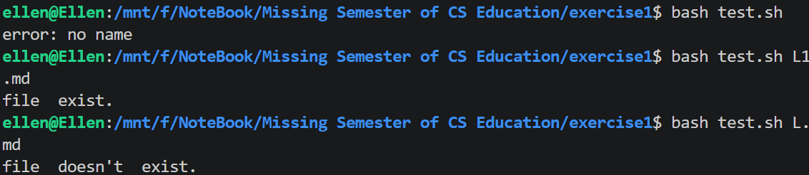
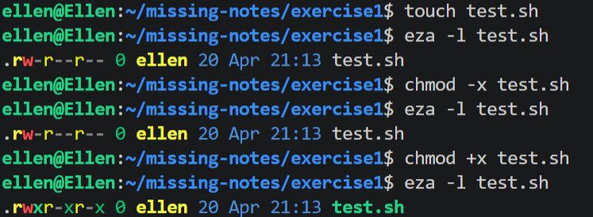
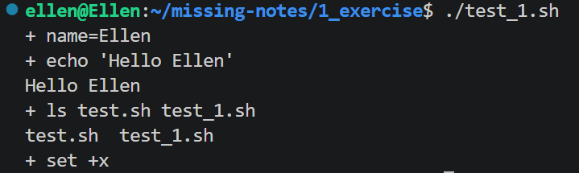
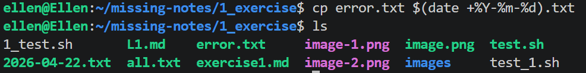
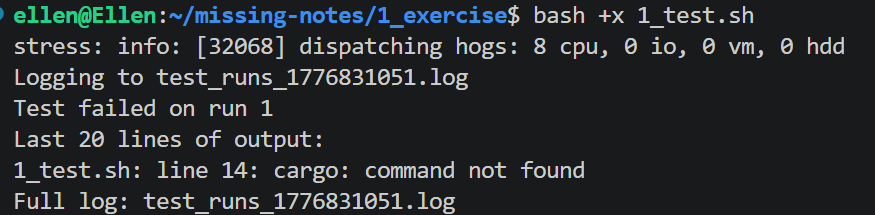

# Missing Semester L1 Shell exercise

## 笔记直接去官网看https://missing-semester-cn.github.io/2026/course-shell/
## Exercise
### 1.可运行 echo $SHELL；若输出类似 /bin/bash 或 /usr/bin/zsh 


### 2.ls -l有什么作用？第一列的十个字母对应的意思？ls -l /又有什么用和区别

```ellen@Ellen:~/xv6-workspace$ ls -l
total 2036
-rwxrwxrwx 1 ellen ellen    1174 Mar 24 22:16 LICENSE
···
ellen@Ellen:~/xv6-workspace$ ls -l /
total 2788
lrwxrwxrwx   1 root root       7 Apr 22  2024 bin -> usr/bin
···
```
第一列:  
1 character indiacates the type of file : d : directory - : ordinary file l : link   
2-4characters : user's permission r:read w:write x:execute  
5-7 : Group's permission   
8-10 : Others' permission  
第二列:  
硬链接数  
- 知识补充:硬链接指得是同文件不同路径，使用ln来增加硬链接数（ln : link files）硬链接的作用是允许一个文件拥有多个有效路径名，这样用户就可以硬链接到重要文件，以防止“误删除”  
所以为什么可以防止误删除？因为对应该目录的索引节点有一个以上的连接，只删除一个连接并不影响索引节点本身和其他的连接，只有当最后一个连接被删除后，文件的数据块及目录的连接才会被释放，也就是说，文件真正删除的条件是与之相关的硬连接文件均被删除  
- user group other : 小组是在大型的任务中，分配给小组使用。  

### 3.在命令 `find ~/Downloads -type f -name "*.zip" -mtime +30` 中，`*.zip` 是一个 「glob」。什么是 glob ？新建一个测试目录并创建一些文件，试试 ls *.txt 、ls file?.txt 、ls {a,b,c}.txt 等模式。

glob是什么?  
glob是一种文件匹配模式，全程global，其实就是搜索你想要的文件的一种名称，匹配匹配其实就是match  
什么是文件模式匹配（Pattern Matching）: 文件操作和脚本编程的核心功能，主要用于文件名匹配、路径搜索和字符串处理
#### Glob 常用语法表   
| 符号 | 说明 |
| :--- | :--- |
| `*` | match除了斜杠(/)之外的所有字符。 |
| `**` | match零个或多个目录及子目录。 |
| `?` | match任意单个字符。(不能是null) |
| `[seq]` | match seq 中的其中一个字符。 |
|`[!seq]` | match不在seq中的任意一个人字符 |
| `/` | 转义符|
| `!` | 排除符|
| `?(pattern_list)` | match零个或一个在`pattern_list`中的字符  |
| `*(pattern_list)` | 匹配零个或多个在 `pattern_list` 中的字符串。 |
| `+(pattern_list)` | 匹配一个或多个在 `pattern_list` 中的字符串。 |
| `@(pattern_list)` | 匹配其中一个在 `pattern_list` 中的字符串。 |
| `!(pattern_list)` | 匹配不在 `pattern_list` 中的字符串。 |
| `[...]` | POSIX style character classes inside sequences. |
1. `[]` （其实对应的就是`[seq]`） 
    - match括号内列出的任意一个字符。例如：
        - `[abc]` 匹配 `a`、`b` 或 `c`。
        - `[a-z]` 匹配任意小写字母。
    - 特殊规则：
        - 连字符（`-`）在方括号内表示范围（如 `a-d` 等价于 `abcd`）。
        - 表示排除的字符需用 `!` 或 `^`，例如 `[!a-z]` 匹配非小写字母。

什么是文件模式匹配（Pattern Matching）: 文件操作和脚本编程的核心功能，主要用于文件名匹配、路径搜索和字符串处理

### 引号有什么作用？
- 参见https://www.gnu.org/software/bash/manual/html_node/Quoting.html
- `!`:在引号中这是一个非常危险的符号,
    这就需要引出一个shell自带的控制符号！, ! 可以在很多地方去使用比如说:
    1. !!: 重复上一条命令
    2. !$: 提取上一个命令的最后一个参数（比如你建了一个非常长的文件mkdir ~ cd !$就可以直接进去）
    3. !gcc 运行最近一次以gcc开头的命令

- Escape Character: /n换行符等等
- single Character: `!` `$` 和 ` 在单引号里只会保留其字符的字面值,而不会发生变量的改变或者调用命令
- double Character: `! $` 等符号会被当做其原本在bash的功能去使用
- `$''` : `\n`等符号会被当做原本的作用而不是取其的字面值.


关于双引号单引号$,其实首选双引号,其次单引号,最后$.千万记住在写变量名的时候别忘记写双引号,因为bash他是不能识别空格符号的.

### 5. shell有三条标准流stdin(0) stdout(1) stderr(2) 运行 `ls /nonexistent /tmp `，把 stdout 和 stderr 分别重定向到两个文件。你将如何把两者都重定向到同一个文件？

- `<` 重定向输入(覆盖fd0)
- `>` 重定向输出(覆盖fd1)
- `>>` 追加重定向输出
- `&>>word`附加标准输出和标准误的格式 / `>>word 2>&1`也是同样的意思
- 在终端中默认是1但如果想改成2,则要在管道符号前加个2

`ls /nonexistent /tmp 2> normal.txt  >> normal.txt`  
`ls /nonexistent /tmp 2> error.txt  > normal.txt`
`ls /nonexistent /tmp > error.txt  > normal.txt`
可以思考一下这三者之间的差别
`ls /nonexistent /tmp &>all.txt` 都重定向到同一个文件

### 7. 为什么 cd 必须是 Shell 内建命令，而不能是独立程序？（提示：想想子进程能影响和不能影响父进程的哪些状态。）

正是因为子进程根本不可能影响到父进程,所以cd才必须是shell内建命令,如果是独立程序,那这个进入只会是暂时的,作为一个子进程,它的任何操作都不会影响到父进程.

### 8. 写一个脚本接收文件参数（$1）, 用test -f 或 [ -f  ... ]检查该文件是否存在，并根据结果输出不同的提示
参考"https://www.gnu.org/software/bash/manual/html_node/Bash-Conditional-Expressions.html"  
如何在shell脚本中写if判断  

- 判断文件 `-e`存在 为真; `-f` 必须存在,且是普通文件; `-z` 表示后面是否存在字符串
- `$1, $2, $3`被称为位置参数,其实就是传入的参数 `$0`是对应的脚本名称，`$1`就是对应的第一个参数 

```
#! /bin/bash

if [ -z "$1" ]; then
        echo "error: no name"
        exit 1
fi

if [ -f "$1" ]; then
        echo  "file  exist."
else
        echo  "file  doesn't  exist."
fi
```

### 9. 把上一题完成的脚本保存为文件（如`check.sh`）。先运行 `./check.sh somefile` ，会发生什么？然后执行 `chmod +x check.sh` 再试一次。为什么这一步是必须的？（提示：比较 chmod 前后的 ls -l check.sh 输出）
 在没有执行`chmod +x test.sh`之前没有x的权限，`./test.sh`就无法直接执行。但是在执行之后，该sh就可直接作为程序运行。这其实就是Linux的文件权限，你如果在wsl中运行，为了匹配windows，wsl其实会直接把权限拉满  
- 如果该文件没有运行权限，`bash file.sh`即可
### 10. 在脚本的 `set` 选项（flag）里加入 -x 会发生什么？写个简单脚本试试并观察输出。  参考https://www.gnu.org/software/bash/manual/html_node/The-Set-Builtin.html

1. 首先先解释set到底是什么？
- 专业去讲的话有三个方面：状态标志位的动态配置，运行时的参数绑定的重定向（位置参数的手动覆写），符号表的转储。
- 通俗点去讲：可以改变shell的运行的行为规则，重新设定位置参数对应的参数，打印当前的变量名，变量值，甚至定义的函数。
2. `set -x`如果写在sh的代码里面，你会发现会把你的代码打印出来并且你会发现$name会直接被替换成对应的name

- tips: -是开启，+是关闭。如果你在终端输入了set —x ，那在你执行任何sh文件的时候，都会显示当前shell正在运行的函数，输入set +x就会表示关闭该功能，其实此处set起的作用就是改变shell的状态动态配置。
- tips: 其实set -x是用来debug，你可以发现从哪一行起就开始不如你所料了，更常见的作法是bash -x test_1.sh(不要在命令行打set -x test_1.sh)

### 11. 写一条命令，把文件复制为带当天日期的备份文件名(例如 `notes.txt → notes_2026-01-12.txt`)。(提示：`$(date +%Y-%m-%d)`)参见https://www.gnu.org/software/bash/manual/html_node/Command-Substitution.html

- 这个实际上是命令替换$(command)或者`command`,两者都可以将括号内容替换成对应的变量，其实就是对结果进行单词拆分和文件名扩展(word splitting and filename expansion)
- Y:year m:month d: date
- tips: 记住要date后要打空格
- this can be used as auto backup copy


### 修改讲义中的「复现偶尔才会失败的测试」脚本（flaky test），使它能够从命令行参数接收测试命令，而不是在脚本中写死 cargo test my_test。(提示：$1 或 $@)参见https://www.gnu.org/software/bash/manual/html_node/Special-Parameters.html
```
#!/bin/bash
set -euo pipefail

# Start CPU stress in background
stress --cpu 8 &
STRESS_PID=$!

# Setup log file
LOGFILE="test_runs_$(date +%s).log"
echo "Logging to $LOGFILE"

# Run tests until one fails
RUN=1
while cargo test my_test > "$LOGFILE" 2>&1; do
    echo "Run $RUN passed"
    ((RUN++))
done

# Cleanup and report
kill $STRESS_PID
echo "Test failed on run $RUN"
echo "Last 20 lines of output:"
tail -n 20 "$LOGFILE"
echo "Full log: $LOGFILE"
```

